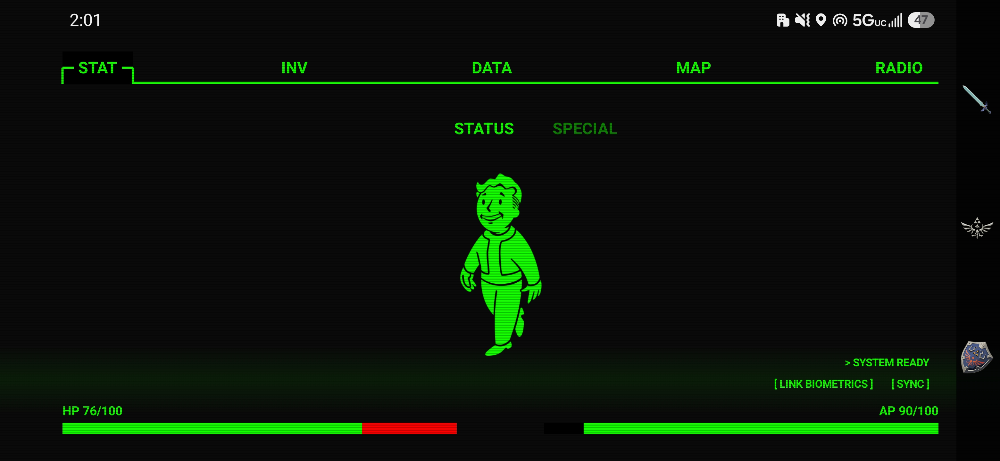
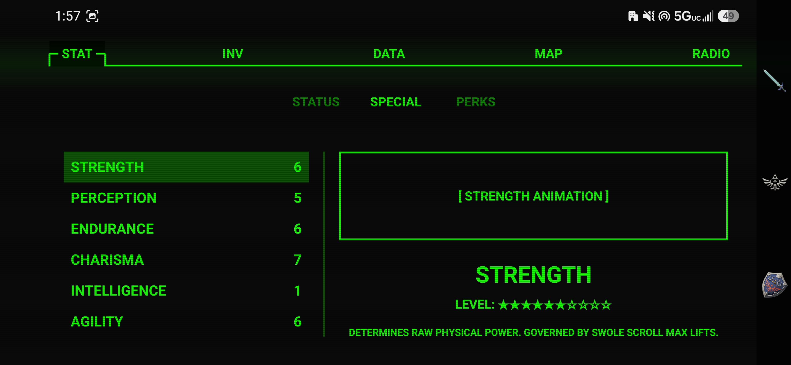
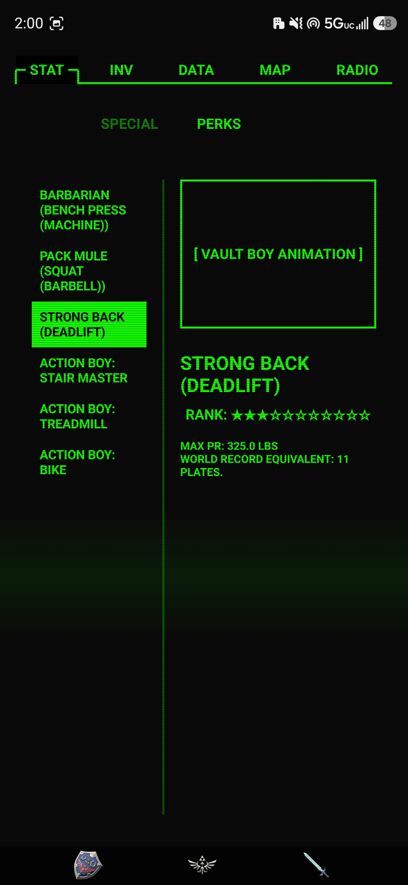
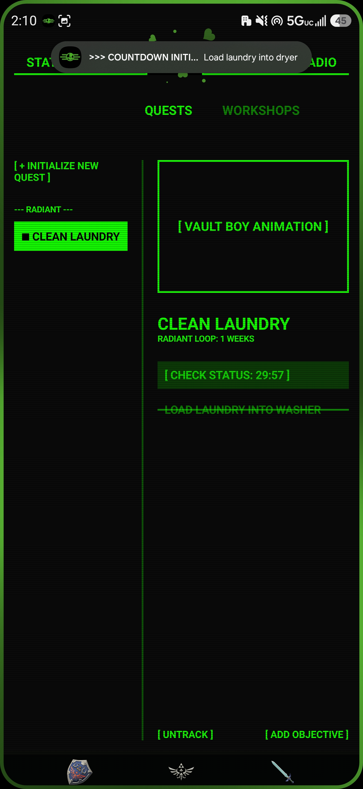
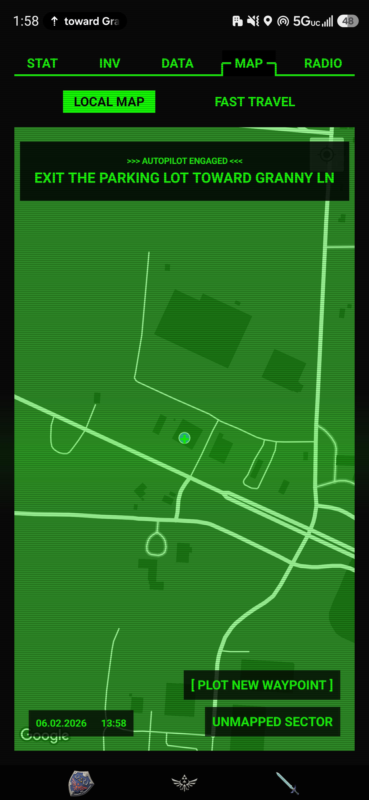
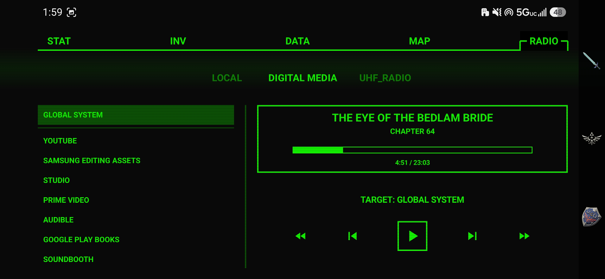

## Screenshots

### STAT

Live character status powered by connected real-world data. HP and AP are mapped to personal metrics such as sleep, recovery, heart rate, and activity.

---

### SPECIAL

SPECIAL stats are connected to real-life systems. Strength, Endurance, and Agility are influenced by workout data from Swole Scroll. Intelligence is linked to GitHub activity. Charisma is currently connected to contacts.

---

### PERKS

Workout achievements become RPG-style perks with ranks, personal records, and progression.

---

### DATA

Tasks become quests with objectives, timers, recurring loops, and archived completions.

---

### MAP

Navigation is translated into immersive route objectives using Google Maps navigation notifications.

---

### RADIO

The Radio tab acts as a Pip-Boy-style media controller for Android apps, allowing supported apps to wake and resume queued media.
